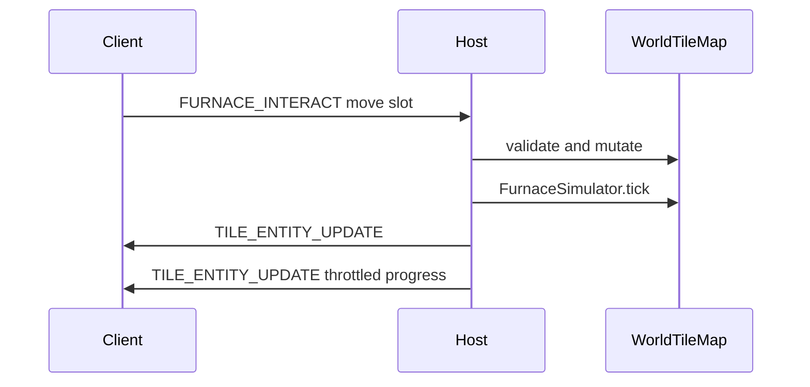

# Furnace smelting (timed, persistent, drops on break) — with multiplayer

## Goals

- **Minecraft-like smelting**: input + fuel + output slots, cook time, fuel burn time; advances on **world time** while the chunk is loaded; catch-up when the chunk loads using stored `lastProcessedWorldTimeMs` vs current `worldTimeMs` (same session + saves via persisted world time).
- **Terraria-like break**: when the furnace tile is destroyed, **spawn item entities for every non-empty stack** at the cell, **then** run normal block loot (furnace item, etc.) — same pattern as chests.
- **Multiplayer (in scope)**: host-authoritative simulation and inventory; clients receive **replicated furnace state** so UI and visuals stay correct; joining clients get state bundled with chunk sync and incremental patches when furnaces change.

## Crafting vs furnace

- **Crafting** ([`CraftingSystem.ts`](../../src/entities/CraftingSystem.ts)): instant, player inventory, station = proximity. Clients are already blocked from crafting ([`Game._handleCraftRequest`](../../src/core/Game.ts)).
- **Furnace**: tile-bound stacks + time. Separate **`SmeltingRecipeRegistry`**, **`FurnaceSimulator`**, and **furnace UI** — do not overload `RecipeDefinition` / crafting list.

## Storage (not `chunk.metadata`)

Per-cell [`metadata`](../../src/world/chunk/Chunk.ts) is one byte; [`World.setBlock`](../../src/world/World.ts) zeros it. Furnaces need a **tile-entity sidecar**:

- `Map<cellKey, FurnaceTileState>` on [`World`](../../src/world/World.ts) (or a small `TileEntityStore`), key `` `${wx},${wy}` ``.
- State: nullable stacks (`itemKey` + `count`) for input / fuel / output; `cookProgressSec`; `fuelRemainingSec`; `lastProcessedWorldTimeMs`.
- **Persistence**: extend [`ChunkRecord`](../../src/persistence/IndexedDBStore.ts) with optional `tileEntities` (per-chunk record: list or map keyed by local `lx,ly`). Merge on chunk load; strip entries when chunk evicted.

**Lifecycle**

- Place furnace block → empty tile state (or lazy on first open).
- `setBlock` / internal writers → if new block is not `stratum:furnace`, **`removeTileEntityAt(wx, wy)`** (centralize so nothing leaks).
- Break → spawn stacks + loot, then remove tile entity.

**First recipe / fuel (data)**

- Smelt: `tag: "stratum:logs"` ×1 → `stratum:charcoal` ×1; `cookTimeSec` tunable (e.g. 5–10s). Log **items** inherit `stratum:logs` from block tags via [`registerBlockItems`](../../src/items/ItemRegistry.ts).
- Fuel table: logs, `stratum:planks` tag, `stratum:stick` with distinct `burnSec`.
- Content: furnace block + item, charcoal item (texture exists), loot table, manifest entries.

## Simulation tick

- Run on **host and solo only**, in [`Game.fixedUpdate`](../../src/core/Game.ts) (same authority pattern as [`BlockInteractions`](../../src/world/BlockInteractions.ts)).
- Step with `deltaMs` from **world time** minus per-furnace `lastProcessedWorldTimeMs` (clamp max catch-up per tick).
- Unloaded chunks: no tick; on load, catch-up step handles elapsed world time.

---

## Multiplayer design

### Authority model

| Responsibility | Host / solo | Client |
|----------------|-------------|--------|
| Smelting + fuel consumption | Yes | No |
| Validate slot moves / pull | Yes | Sends requests |
| Apply `setBlock` from mining | Host drives `BLOCK_UPDATE` | Receives |

### Wire format: chunk bundle (initial sync + streaming)

Extend **CHUNK_DATA** payload **backward-compatibly**:

- Today: `[type][cx i32][cy i32][blocks u16×N][background u16×N]` ([`BinarySerializer.serializeChunk`](../../src/network/protocol/BinarySerializer.ts)).
- **v3**: If `buffer.byteLength` exceeds the v2 size, parse a **trailing** section (old `deserializeChunk` today stops after background; new decoder reads optional tail only when length allows).

**Trailing section (concrete suggestion)**

- `u32` magic / version tag for this extension (e.g. `0x5445_0001` = “TE v1”).
- `u16` entity count.
- For each entity: `u8 lx`, `u8 ly`, `u8 kind` (1 = furnace), then furnace-specific packed fields (stacks as `u16 itemId` + `u16 count` or UTF8 key + count — prefer **numeric itemId** for size; map id→key on both sides via `ItemRegistry`), plus `float64` or `u32` for progress / fuel / `lastProcessedWorldTimeMs`.

**Host**: [`ChunkSyncManager.sendAllChunksTo`](../../src/network/ChunkSyncManager.ts) (and any path that emits `CHUNK_DATA`) appends the tail from `World` tile entities in that chunk.

**Client**: [`Game` inbound `CHUNK_DATA`](../../src/core/Game.ts) calls `World.applyAuthoritativeChunk(..., tileEntities?)` which **replaces** the tile-entity partition for that chunk (full snapshot per message — simple and consistent).

### Incremental sync (avoid resending whole chunk on every smelt tick)

Add a **new message type** (e.g. `TILE_ENTITY_UPDATE = 0x0e` in [`MessageType`](../../src/network/protocol/messages.ts)):

- Payload: world `x,y` (i32), `kind`, furnace state blob (same encoding as one entry in chunk tail).
- **Host** broadcasts to all peers when:
  - Any furnace inventory mutation (player move stack),
  - Furnace placed/broken (break can be implied by `BLOCK_UPDATE` + explicit delete, or one TE update),
  - Smelting produces a **meaningful** change (output count changes, fuel item consumed, input consumed, cook progress — **throttle** progress sync e.g. every 150–250ms per furnace to limit bandwidth while keeping UI responsive).

Implement `encode`/`decode` **default** case today throws on unknown types ([`messages.ts`](../../src/network/protocol/messages.ts) ~651) — all session peers must run the same build; optionally bump **handshake protocol version** so mismatched clients fail fast with a clear error.

### Client → host: furnace interactions

- New message e.g. `FURNACE_INTERACT` (or generic `TILE_ENTITY_REQUEST`): `wx, wy`, action enum (`move_slot` with from/to indices, `take_output`, etc.), small payload.
- **Host** validates: peer’s player in reach (Chebyshev / same constant as break), target cell is furnace, rules for stack merge/split match solo behavior; mutates tile state; **broadcasts** `TILE_ENTITY_UPDATE` to **all** clients (including sender) for one source of truth.
- **Client UI**: same furnace panel as solo; on submit, send request; show optimistic UI only if desired — safer to wait for host echo (avoids desync).

### `BLOCK_UPDATE` interaction

- Client receives [`BLOCK_UPDATE`](../../src/core/Game.ts) → `world.setBlock` → must **clear** tile entity for that cell when the new block is not a furnace (already required on host when placing air).

### Solo / host local edits

- When **host** player breaks/places/mutates furnace locally (same process as authority), use the same code paths as remote: update tile map, **broadcast** `TILE_ENTITY_UPDATE` (and existing `BLOCK_UPDATE`) so other clients stay in sync.

---

## UI

- Target **which** furnace: mouse-targeted block in reach when opening furnace UI (or dedicated interact key).
- Three slots + fuel/progress indicators; reuse inventory slot patterns from [`InventoryUI`](../../src/ui/InventoryUI.ts).
- Open question (product): mirror crafting “inventory + side panel” layout vs modal — match existing game chrome.

---

## Implementation checklist (ordered)

1. **Tile model + persistence** — `FurnaceTileState`, chunk `ChunkRecord.tileEntities`, `World` merge/evict/clear on `setBlock`, break spill in [`Player.ts`](../../src/entities/Player.ts).
2. **Smelting + fuel data** — JSON load, `FurnaceSimulator.tick(worldTimeMs)` on authority.
3. **Content** — furnace block/item, charcoal, recipes, fuel table, loot.
4. **Furnace UI + solo wiring** — bus events, host-only handlers initially.
5. **Network** — extend `BinarySerializer` CHUNK_DATA tail; `MessageType.TILE_ENTITY_UPDATE` + `FURNACE_INTERACT` (names flexible); `ChunkSyncManager` + `Game` encode/decode; `World.applyAuthoritativeChunk` TE branch; host broadcast on change + throttled progress.
6. **Tests / manual** — two clients, place furnace, smelt, disconnect/reconnect chunk, break and verify drops for both players.

